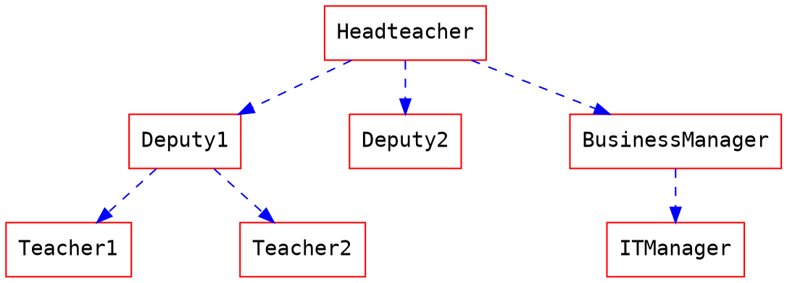

## Definition

Let $G$ be a graph, and let $v$ and $w$ be vertices in $G$.

### Walk

A walk from $v$ to $w$ is a finite alternating sequence of adjacent vertices and edges of $G$. Thus a walk has the form $$v_{0} \, e_{1} \, v_{1} \, e_{2} \, \dots v_{n-1} \, e_{n} \, v_{n}$$ where

- the $v$'s represent vertices
- the $e$'s represent edges
- $v_{0} = v, v_{n} = w$
- for each $i = 1, 2, \dots n, v_{i-1}$ and $v_{i}$ are the endpoints of $e_{i}$.

### Trivial walk

The trivial walk from $v$ to $v$ consists of the single vertex $v$.

### Path

A path from $v$ to $w$ is a trail that does not contain a repeated vertex.

### Closed walk

A closed walk is a walk that starts and ends at the same vertex.

### Circuit

A circuit is a closed walk that contains at least one edge and does not contain a
repeated edge.

### Simple circuit

A simple circuit is a circuit that does not have any other repeated vertex except the
first and last.

|                    | Repeated Edge? | Repeated Vertex? | Starts and Ends at the Same Point? | Must Contain at Least One Edge? |
| ------------------ | ------------------------------------ | -------------------------------------- | -------------------------------------------------------- | ----------------------------------------------------- |
| **Walk**           | allowed                              | allowed                                | allowed                                                  | no                                                    |
| **Trail**          | no                                   | allowed                                | allowed                                                  | no                                                    |
| **Path**           | no                                   | no                                     | no                                                       | no                                                    |
| **Close walk**     | allowed                              | allowed                                | yes                                                      | no                                                    |
| **Circuit**        | no                                   | allowed                                | yes                                                      | yes                                                   |
| **Simple circuit** | no                                   | first and last only                    | yes                                                      | yes                                                   |
