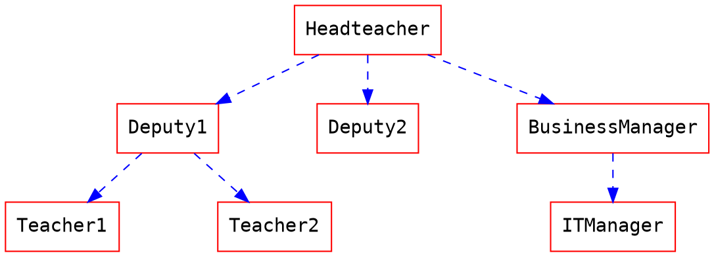

```graphviz
digraph hierarchy {

                nodesep=1.0 // increases the separation between nodes
                
                node [color=Red,fontname=Courier,shape=box] //All nodes will this shape and colour
                edge [color=Blue, style=dashed] //All the lines look like this

                Headteacher->{Deputy1 Deputy2 BusinessManager}
                Deputy1->{Teacher1 Teacher2}
                BusinessManager->ITManager
                {rank=same;ITManager Teacher1 Teacher2}  // Put them on the same level
}
```


## Definition

Let $G$ be a graph, and let $v$ and $w$ be vertices in $G$.

### Walk

A walk from $v$ to $w$ is a finite alternating sequence of adjacent vertices and edges of $G$. Thus a walk has the form $$v_{0} \, e_{1} \, v_{1} \, e_{2} \, \dots v_{n-1} \, e_{n} \, v_{n}$$ where

- the $v$'s represent vertices
- the $e$'s represent edges
- $v_{0} = v, v_{n} = w$
- for each $i = 1, 2, \dots n, v_{i-1}$ and $v_{i}$ are the endpoints of $e_{i}$.

### Trivial walk

The trivial walk from $v$ to $v$ consists of the single vertex $v$.

### Path

A path from $v$ to $w$ is a trail that does not contain a repeated vertex.

### Closed walk

A closed walk is a walk that starts and ends at the same vertex.

### Circuit

A circuit is a closed walk that contains at least one edge and does not contain a
repeated edge.

### Simple circuit

A simple circuit is a circuit that does not have any other repeated vertex except the
first and last.


|                    | <font color="#00b0f0">Repeated Edge? | <font color="#00b0f0">Repeated Vertex? | <font color="#00b0f0">Starts and Ends at the Same Point? | <font color="#00b0f0">Must Contain at Least One Edge? |
| ------------------ | ------------------------------------ | -------------------------------------- | -------------------------------------------------------- | ----------------------------------------------------- |
| **Walk**           | allowed                              | allowed                                | allowed                                                  | no                                                    |
| **Trail**          | no                                   | allowed                                | allowed                                                  | no                                                    |
| **Path**           | no                                   | no                                     | no                                                       | no                                                    |
| **Close walk**     | allowed                              | allowed                                | yes                                                      | no                                                    |
| **Circuit**        | no                                   | allowed                                | yes                                                      | yes                                                   |
| **Simple circuit** | no                                   | first and last only                    | yes                                                      | yes                                                   |


Takahashi is managing the number of trees in his garden. Initially, there are no trees in the garden.

Q queries are given in order. Each query is one of the following two types. Immediately after processing each query, output the number of trees currently in the garden.

- `1 h` : Add one new tree of height h to the garden.
- `2 h` : Remove all trees currently in the garden whose height is at most h.
Determine whether there exists a weighted undirected tree with N vertices satisfying the following condition.

- For any two integers i and j with 1≤i<j≤N, the distance between vertices i and j is Ai,j​.

Here, the distance between vertices i and j is defined as the sum of the weights of the edges on the unique simple path connecting these two vertices.


### Sample Input 1

```
4 4
1 2
2 3
3 4
1 3
```

### Sample Output 1

```
1
1
2
-1
```

Immediately after processing queries 1,2,3, a valid coloring exists.

For example, immediately after processing the third query, vertices 1,2,3,4 can be colored `white`, `black`, `white`, `black`, respectively. No valid coloring with fewer `black` vertices exists, so output 2.

Immediately after processing the fourth query, no valid coloring exists. Thus, output −1.